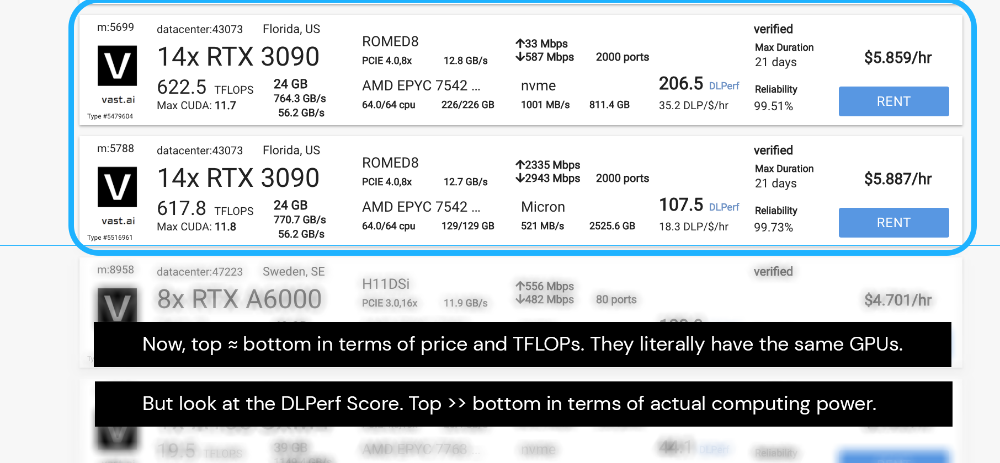

# Task 2 — Computing Cost Estimation

**NOTE:** For submission, please do a screen recording with verbal explanations for whatever you are doing to complete this task.

Task 2 is quite tedius, but this will definitely get you more hands-on experience (which I think you really need at this stage).

**Objective:** For each of the following possible choices of GPU cloud servers, train [StyleNAT](https://github.com/SHI-Labs/StyleNAT) with default configuration on the [FFHQ-256 dataset](https://github.com/crrrr30/stylenat_setup/blob/main/data_handling.md) for 1k iterations, utilizing as much GPU space as possible by adjusting the [batch size](https://stats.stackexchange.com/questions/153531/what-is-batch-size-in-neural-network):

| #| GPU | RAM per GPU (GB) | Est. Pricing (\$/hr)  | Est. [TFLOPS](https://www.digitaltrends.com/computing/what-is-a-teraflop/) per GPU
| ---- | ---- | ---- | ---- | ----
| 8/14 | RTX 3090 | 24 GB | 2.821 | 44.1
| 8 / 10 | RTX A6000 | 48 GB | 4.701 / 5.871 | 45.1
| 4 / 8 | A100 SXM4 | 80 GB | 8.021 / *N/A* | 19.5
| *8* | RTX 4090 | 24 GB | N/A | 103.7
| *8* | *Tesla V100* | *32 GB* | *N/A* | 13.2

Notes:
- The last two rows are optional. You might not find them on any platform;
- **TFLOPS IS NOT EVERYTHING!** The 3090s and 4090s are fast, but there are [caveats](https://www.reddit.com/r/deeplearning/comments/zau0uc/gpu_comparisons_rtx_6000_ada_vs_a100_80gb_vs_2x/) to training on these gaming-designed GPUs;
- I suggest looking on [Vast.ai](https://vast.ai/) first, before going to [Lambda Labs](https://lambdalabs.com/). Lambda Labs' GPUs are generally more expensive (see for yourself!), but they have the top-notch ones. (Look into the new [H100s](https://get.lambdalabs.com/h100-cloud-reserved)!)

Quick example why many other factors matter:

The server on the top (in the blue box) has nvme disk with basically twice the bandwidth of the bottom one, which has a Micron disk (if you find these online, hover over these numbers/labels/etc. and more explanation will pop up).

The purpose of this task is to find the most cost-efficient way of renting cloud GPUs for our experiments. Sadly, our budget is very limited: I'm expecting \$2,000 on the way, and we each receive \$4,200 for compensation. There's no further guarantee of funding for this project.

To get the best estimate, we need to *actually train* a little bit to give an estimate. The numbers we obtain here will likely change when we implement our own neural network (in the place of StyleNAT; that is, we replace the code that defines the StyleNAT model with our own, but we use the same training scheme, dataset, etc.). Why do you think so? Google and learn about how the FLOP count of a model may be related to this difference.

This will cost \$\$. Since we're expecting \$2,000 on the way, just tell me the total cost and I'll Venmo you or something like that (hopefully I can see the cost presented in an organized, tabulated fashion 😬). You'll need to first load your account with some balance.

The following is a possible solution (I welcome you to *explore* as many options as possible, so long as what you do is conduce to the completion of this task). I have intentionally left it concise to encourage you to *explore* more. I repeat this over and over again because I really believe this is an important skill to have as a programmer. Anyway:

## Step 1: Setting Up the Environment

## Step 2: Downloading and Pre-Processing Data

I might try and optimize the code to spare the processing to extract the FFHQ dataset. I'll let you know. This process can take around 30–40 mins.

## Step 3: Training StyleNAT

First, download the code base to the server. (How? Hint: some command called `git clone`) .

The code needs some slight modifications before it can be run on your cloud server, even though the environment has already been set up. Trust me, this was *the hardest* part, but you won't have to worry about that! It's really just the [config files](https://opensource.com/article/21/6/what-config-files) that you need to change. There are two of them: `StyleNAT/conf/config.yaml` and `StyleNAT/conf/runs/ffhq_256.yaml`. Please figure out what changes to make specifically in order to run the code.

## Step 4: Recording the Output

Here is a short (non-exhaustive) checklist from experience to make sure that the model is being trained properly:

### 1. GPU Utilization

Open a separate terminal connected to the cloud server. Use the command `watch -n .1 nvidia-smi` to monitor the GPU usage. You should see that the `Volatile GPU-Util` for all GPUs fluctuate between close to 0\% to close to 100\%).

### 2. d